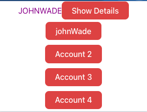
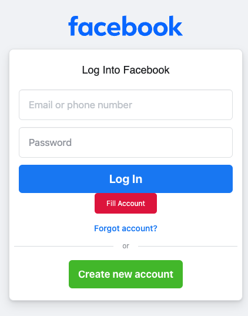
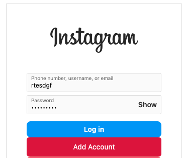
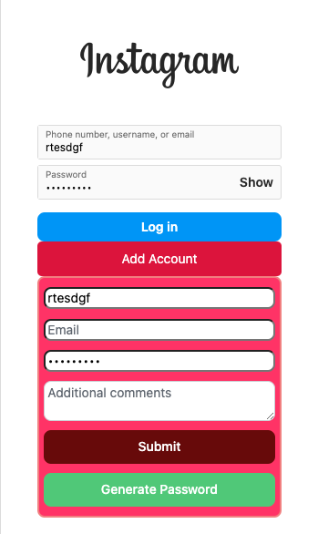

# Password Manager Extension

A chrome extension for [Password Manager ](https://github.com/BeginnerLevelUP/passwordManager)

## Features
* Gets information from your account automatically
* Takes you to your saved password/account with a simply click
* If a password/account is saved you can simply click 'Fill Account'
* If you're on a new page where created an account is needed you can add that account to your profile

## Images

### Installing
Stop by the chrome webstore for the [Password Manager]()
*Currently Pending Review By Google*

## Help
Since I created this project on my own and my first time ever building a chrome exetenison I'm sure there's alot of bugs and features I could add in the future 

## Authors

Contributors names and contact info

[Damion Morgan](https://github.com/BeginnerLevelUP)

## Version History

* 0.1
    * Initial Release

## License

This project has no license 

